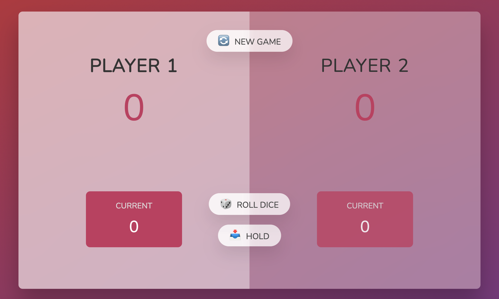

# Roll the dice game

This is a game I made to test my skills after learning JavaScript fundamentals.

## Table of contents

- [Screenshot](#screenshot)
- [Game rules](<(#game-rules)>)
- [Built with](#built-with)
- [What I learned](#what-i-learned)
- [Useful resources](#useful-resources)
- [Author](#Author)

### Screenshot

### Game rules

Every roll dice gets acumulated in the current score of the player.
If the dice shows 1 the current score resets to 0 and the player is switch.
The player must press the hold button in order to keep the current score in the player score.
The player who gets to 100 points wins the game.

### Built with

- HTML5
- CSS
- Flex
- JavaScript

### What I learned

Recap over some of my learnings while working through this project.

### Useful resources

- [Fonts](https://fonts.googleapis.com/css2?family=Nunito&display=swap)

## Author

- Twitter - [@melencu](https://twitter.com/melencu)
- GitGub - [@melencu](https://github.com/melencu)
